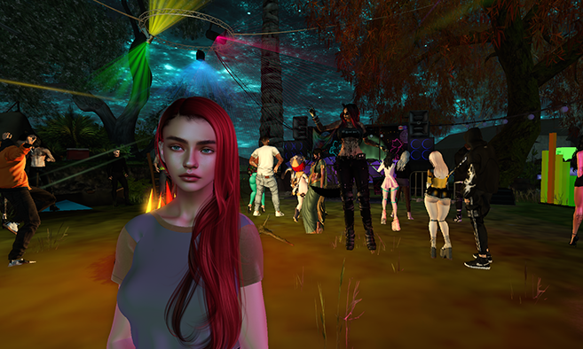

# Open Stage Island



[](https://secondlife.com/destination/open-stage-island)
[](https://secondlife.com/destination/open-stage-island)

## About

**Open Stage Island** is an evolving music community in Second Life, set in a beautiful natural environment where the magic is brought by you! Established since 2021, this destination has grown into a vibrant social hub.

### What Makes Open Stage Island Special?

- **24/7 Open Air Stage** — Available to all electronic music artists for live audience feedback
- **DJ School** — Learn the art of DJing and improve your skills
- **Freebies & Interactive Experiences** — Discover free items and engaging activities
- **Inclusive Community** — Welcoming to newcomers, LGBTQI+ individuals, and furries
- **Live DJ Performances** — Talented DJs and producers showcase their skills nightly

## Location

| Property | Value |
|----------|-------|
| **Region** | Derwent |
| **Coordinates** | 248/128/22 |
| **Maturity Rating** | Moderate |
| **Category** | Music |
| **In Operation Since** | 2021 |

## Teleport There

Click the link below or copy the SLURL to teleport directly to Open Stage Island:

**Direct Teleport:** [secondlife://Derwent/248/128/22](secondlife://Derwent/248/128/22)

**Web Maps:** [Open Stage Island on Second Life Maps](https://maps.secondlife.com/secondlife/Derwent/248/128/22)

**Destination Page:** [secondlife.com/destination/open-stage-island](https://secondlife.com/destination/open-stage-island)

## Community

Open Stage Island is more than just a venue — it's a community. Whether you're:

- An **electronic music artist** looking to perform live and get real-time feedback
- A **DJ or producer** wanting to showcase your mixing skills
- A **party-goer** who loves to dance the night away
- A **newcomer** to Second Life seeking a welcoming environment
- Someone from the **LGBTQI+ community** or a **furry** looking for a safe space

You'll find your place at Open Stage Island!

## Features at a Glance

| Feature | Available |
|---------|-----------|
| Open Air Stage | 24/7 |
| DJ School | Yes |
| Freebies | Yes |
| Interactive Experiences | Yes |
| Social Hub | Yes |
| Newcomer Friendly | Yes |
| LGBTQI+ Welcome | Yes |
| Furry Friendly | Yes |

## Gallery


*Click the image above or visit the [images folder](images/) for more screenshots.*

## Connect

- **Official Destination Page:** [https://secondlife.com/destination/open-stage-island](https://secondlife.com/destination/open-stage-island)
- **Second Life Maps:** [https://maps.secondlife.com/secondlife/Derwent/248/128/22](https://maps.secondlife.com/secondlife/Derwent/248/128/22)

## About This Repository

This repository serves as a documentation hub and landing page for Open Stage Island in Second Life. It's maintained by the openstageisland organization.

### Repository Structure

```
openstageisland.github.io/
├── .github/
│   └── workflows/
│       └── ci.yml           # GitHub Actions workflow
├── assets/
│   └── style.css            # Custom styles
├── images/
│   └── destination-image.png # Official destination image
├── index.html               # Landing page
├── README.md                # This file
└── _config.yml              # Jekyll configuration
```

## Contributing

This is an open documentation project. If you have information to add or corrections to make, feel free to submit a pull request.

## License

This documentation is provided for informational purposes. All Second Life and Open Stage Island content belongs to their respective owners.

---

**Join the party, attend DJ school, and dance your avatar's bottom off!**

*Last updated: August 2026*
